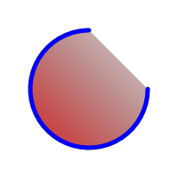

# Exemples AGGPas

Dessin avec l'unité *agg_2D.pas*. Création d'une image PNG avec la bibliothèque *fcl-image*.



## Où trouver AGGPas

AGGPas fait partie de fpGUI et de Lazarus.

### fpGUI

```
git clone --single-branch --branch maint https://github.com/graemeg/fpGUI.git
```

```
SHA1=e127c5b09e31cdd240b16f3fff4509aefbc30ec0
URL=https://github.com/graemeg/fpGUI.git
PROJECT_NAME=e127c5b
git clone $URL $PROJECT_NAME
cd $PROJECT_NAME
git reset --hard $SHA1
```

### Lazarus

```
git clone https://gitlab.com/freepascal.org/lazarus/lazarus.git
```

Les unités se trouvent dans le dossier [components/aggpas/src](https://gitlab.com/freepascal.org/lazarus/lazarus/-/tree/main/components/aggpas/src?ref_type=heads).

## Comment compiler les exemples

Compiler un exemple :
```
make arc
```

Compiler tous les exemples :
```
make
```

Vous devrez modifier dans *Makefile* le chemin vers les unités AGGPas.

## Unité AggExample

L'unité *AggExample* est dérivée du programme [Agg2DConsole.dpr](https://github.com/graemeg/fpGUI/blob/develop/extras/aggpas/agg-demos/Agg2DConsole.dpr).
