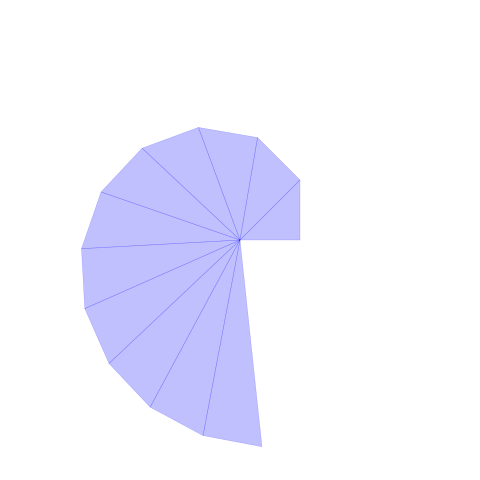

# Theodorus spiral

Example for the [mathlib-fp](https://github.com/ikelaiah/mathlib-fp) library.

| Vector coordinates | Length | Square root |
| --- | --- | --- |
| <1, 1> | 1.4142 | √2 |
| <0.292893, 1.70711> | 1.7321 | √3 |
| <-0.692705, 1.87621> | 2.0000 | √4 |
| <-1.63081, 1.52986> | 2.2361 | √5 |
| <-2.31498, 0.800536> | 2.4495 | √6 |
| <-2.6418, -0.144552> | 2.6458 | √7 |
| <-2.58716, -1.14306> | 2.8284 | √8 |
| <-2.18303, -2.05776> | 3.0000 | √9 |
| <-1.49711, -2.78544> | 3.1623 | √10 |
| <-0.61628, -3.25886> | 3.3166 | √11 |
| <0.366304, -3.44468> | 3.4641 | √12 |
